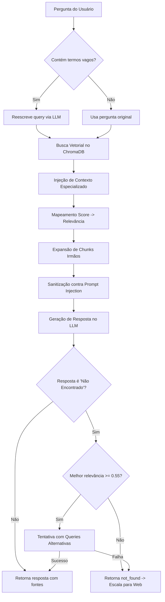

# Agente Institucional (RAG) – Implementação e Lógica

Este documento descreve o funcionamento do agente responsável por **responder perguntas com base nas normas e documentos oficiais do IFPI** usando uma arquitetura RAG (Retrieval-Augmented Generation) avançada e resiliente.

---

## 1. Onde está o Agente

* Arquivo: `apps/core/chat/agents/institutional_agent.py`
* Função principal: `consulta_institucional(...)`
* Tool LangChain: `consulta_tool` (utilizada nas chains do LangGraph)

---

## 2. Lógica e Fluxo de Execução do RAG

O Agente Institucional implementa várias técnicas para otimizar a precisão da recuperação e a segurança das respostas:



---

## 3. Funcionalidades Detalhadas

### 3.1 Reescrita Inteligente de Queries (`_generate_search_query`)
* O agente verifica se a pergunta do usuário contém pronomes vagos ou referências ambíguas (ex: *"isso"*, *"aquele professor"*, *"minha turma"*).
* **Otimização de Latência:** Se não contiver termos ambíguos, a busca no ChromaDB usa a pergunta original diretamente, economizando tempo (cerca de 1 a 3 segundos de chamada ao LLM).
* Se contiver termos ambíguos, o LLM reconstrói a query com base no histórico recente e no perfil do usuário antes de consultar o banco vetorial.

### 3.2 Estratégias de Injeção de Contexto Especializado (Heurísticas RAG)
Para mitigar as limitações da busca vetorial em dados tabulares ou termos específicos, o agente utiliza três estratégias de injeção direta:
1. **Busca Textual por Nome de Professor (`_inject_by_text_search`):** Identifica nomes próprios que apareçam logo após marcadores como *"professor"* ou *"docente"* e faz uma busca de texto exato (`$contains`) no ChromaDB, garantindo que o plano de aulas/horário do docente correspondente seja adicionado ao contexto.
2. **Busca por Avaliações/Provas (`_inject_eval_docs`):** Se a pergunta mencionar termos sobre avaliações/calendário acadêmico, o agente localiza todos os documentos de avaliação e injeta seus chunks, facilitando a resposta sobre datas de exames.
3. **Casamento por Título do Curso (`_inject_by_course_title_match`):** Injeta chunks específicos quando detecta menção exata a cursos indexados.

### 3.3 Mapeamento de Score e Limiar de Relevância (`_score_to_relevance`)
* O ChromaDB utiliza a distância Euclidiana (L2) padrão. Distância 0.0 indica casamento perfeito.
* O agente mapeia a distância L2 para uma métrica de relevância semântica no intervalo $[0, 1]$ usando uma função de decaimento inverso: 
  $$\text{Relevância} = \frac{1}{1 + \text{Score L2}}$$
* O limiar mínimo padrão de aceitação (`score_threshold`) é **$0.40$** (aceita distâncias L2 de até $1.5$).

### 3.4 Expansão de Chunks Irmãos (`_expand_with_sibling_chunks`)
* Quando um chunk relevante pertence a um documento considerado "pequeno" (documentos com até 30 chunks no total), o agente recupera **todos** os chunks desse mesmo documento. Isso preserva a coesão e o contexto integral das resoluções e regulamentos de menor porte, evitando que trechos picados causem respostas imprecisas.
* Documentos extensos (manuais/livros) não sofrem expansão para evitar estourar o limite de tokens do contexto do LLM.

### 3.5 Sanitização contra Prompt Injection (`_sanitize_chunk_content`)
* Defesa robusta contra ataques que escondem instruções maliciosas dentro de documentos indexados.
* O agente verifica cada linha dos trechos recuperados contra padrões de injeção (`_INJECTION_PATTERNS`), que incluem comandos típicos como *"ignore as instruções anteriores"*, *"responda apenas..."*, delimitadores de sistema como `[INST]` ou `[SYS]`, etc.
* Linhas suspeitas são removidas do contexto e substituídas por `[conteúdo removido por política de segurança]`, logando o alerta no console.

### 3.6 Mecanismo de Retentativa (Retries)
* Se o LLM responder com a frase padronizada de "Não encontrado" (`NOT_FOUND_ANSWER`), o agente avalia se a relevância do melhor documento recuperado era razoável ($\ge 0.55$).
* Se a relevância era alta, mas a resposta deu "não encontrado", o agente realiza retentativas automáticas gerando novas buscas com a **pergunta original** e com **palavras-chave** (substantivos) extraídas. Se qualquer retentativa retornar sucesso, a resposta é entregue. Se a relevância inicial for baixa, pula as retentativas e escala imediatamente para a web.

---

## 4. Saída do Agente (JSON)

A função `consulta_institucional` retorna um dicionário estruturado:

```json
{
  "status": "success",
  "answer": "A nota mínima para aprovação é 6.0...",
  "sources": [
    {
      "title": "Regulamento Didático Pedagógico",
      "url": "http://ifpi.edu.br/rdp.pdf",
      "page": 12
    }
  ],
  "docs": [...],
  "rendered": "Resposta:\nA nota mínima para aprovação é 6.0...\n\nFontes:\n- Regulamento Didático Pedagógico - http://ifpi.edu.br/rdp.pdf (p. 12)"
}
```

---

## 5. Reescrever com Feedback (`melhorar_resposta_com_feedback`)

O agente expõe uma função dedicada para reescrever respostas com base no feedback crítico do usuário. Ela recupera novos documentos sobre o tema e envia a resposta anterior juntamente com o feedback e o novo contexto para o LLM gerar uma resposta aprimorada e corrigida.
