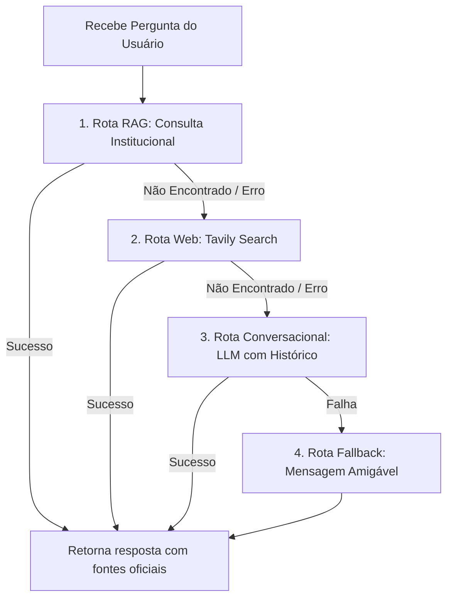

# Supervisor de Rotas – Implementação e Fluxo

Este documento descreve o funcionamento do agente supervisor responsável por **coordenar a conversação** e rotear as perguntas do usuário para o canal de resposta mais adequado.

---

## 1. Onde está o Agente

* Arquivo: `apps/core/chat/agents/supervisor.py`
* Função principal: `supervisor(state: dict, config: dict = None) -> dict`

---

## 2. Entrada esperada

O supervisor recebe o estado atual do grafo (`state`), que contém o histórico de mensagens e o perfil do usuário:

```python
{
  "messages": [
    HumanMessage(content="Quais são as regras para trancamento de curso?"),
  ],
  "user_profile": "Estudante do curso de Informática, Campus Teresina Central."
}
```

---

## 3. Lógica de Roteamento (Em Ordem de Prioridade)

O agente supervisor extrai a última mensagem enviada pelo usuário, reconstrói o contexto da conversa (limite de até 12 mensagens anteriores) e executa o seguinte fluxo de decisão sequencial:



### 3.1 Rota RAG / Consulta Institucional
* **Função chamada:** `consulta_institucional` (do módulo `institutional_agent.py`)
* **Objetivo:** Buscar a resposta na base de dados local (ChromaDB) contendo as normas internas e regulamentos oficiais do IFPI.

### 3.2 Rota Web (Tavily Search)
* **Função chamada:** `responder_web` (do módulo `web_agent.py`)
* **Objetivo:** Se a informação não for encontrada localmente, busca dados atualizados na internet pública usando a API do Tavily. Restringido ao escopo institucional do IFPI.

### 3.3 Rota Conversacional
* **Função chamada:** `_responder_conversacional`
* **Objetivo:** Se a busca local e a web falharem, o LLM tenta formular uma resposta baseada unicamente no histórico da conversa e na data atual (útil para perguntas como *"Que dia é hoje?"* ou de continuação como *"Então isso já passou?"*).

### 3.4 Fallback Amigável
* **Função chamada:** `_friendly_fallback`
* **Objetivo:** Se nenhuma das rotas anteriores for bem-sucedida, o supervisor gera uma resposta padronizada e amigável informando que a informação não pôde ser encontrada de forma confiável e convidando o usuário a reformular a pergunta.

---

## 4. Saída do Agente

O supervisor retorna uma atualização do estado do grafo adicionando uma nova `AIMessage` à lista de mensagens. Esta mensagem contém o texto de resposta formatado e metadados estruturados:

```python
{
  "messages": [
    AIMessage(
      content="Resposta:\nSegundo o regulamento...",
      additional_kwargs={
        "structured": {
          "status": "success",
          "answer": "Segundo o regulamento...",
          "sources": [{"title": "Regulamento Acadêmico", "url": "http://..."}]
        },
        "thoughts": "{\"decision\": {\"route\": \"consulta_institucional\", ...}, ...}"
      }
    )
  ]
}
```

* **`thoughts` (JSON String):** Contém o registro de decisões internas do supervisor (qual rota foi tomada, quais documentos ChromaDB foram retornados, o perfil, a data, etc.) para fins de auditoria e depuração no painel de administração.

---

## 5. Como testar

```python
from langchain_core.messages import HumanMessage
from apps.core.chat.agents.supervisor import supervisor

# Criação do estado mockado
estado = {
    "messages": [HumanMessage(content="Qual o prazo de matrícula no IFPI?")],
    "user_profile": ""
}

# Invocação do supervisor
resultado = supervisor(estado)
msg_resposta = resultado["messages"][0]

print("Conteúdo da Resposta:")
print(msg_resposta.content)
print("\nMetadados Estruturados:")
print(msg_resposta.additional_kwargs["structured"])
```
